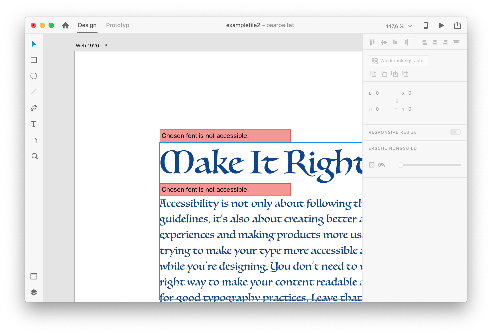

# XD Plugin Helper Library

Adobe XD is a great tool to create interactive prototypes for user experiences. Because they have just started to develop their plugin platform we often have to use some workarounds. This library is the place to collect all the little helpers to develop awesome Adobe XD Plugins.

The library will be extended and you can always push merge requests to add your own helpers.

## Available Helpers

### Error Rectangle


This helper will create error rectangles as shown above.

#### Create a group of erros
```javascript
import { XDNodeErrorGroup } from "xd-plugin-helper";

const errors = [
    node: //add an actual node from XD,
    msg: //error text you want to display
]

const errorGroup = new XDNodeErrorGroup(errorNodeList);
errorGroup.addErrors();
```

#### Create a single error rectangle
```javascript
import { XDNodeErrorRectangle } from "xd-plugin-helper";

const xdNode = // actual XD Node
const error = new XDNodeErrorRectangle(xdNode);
error.create("Your error message");
```